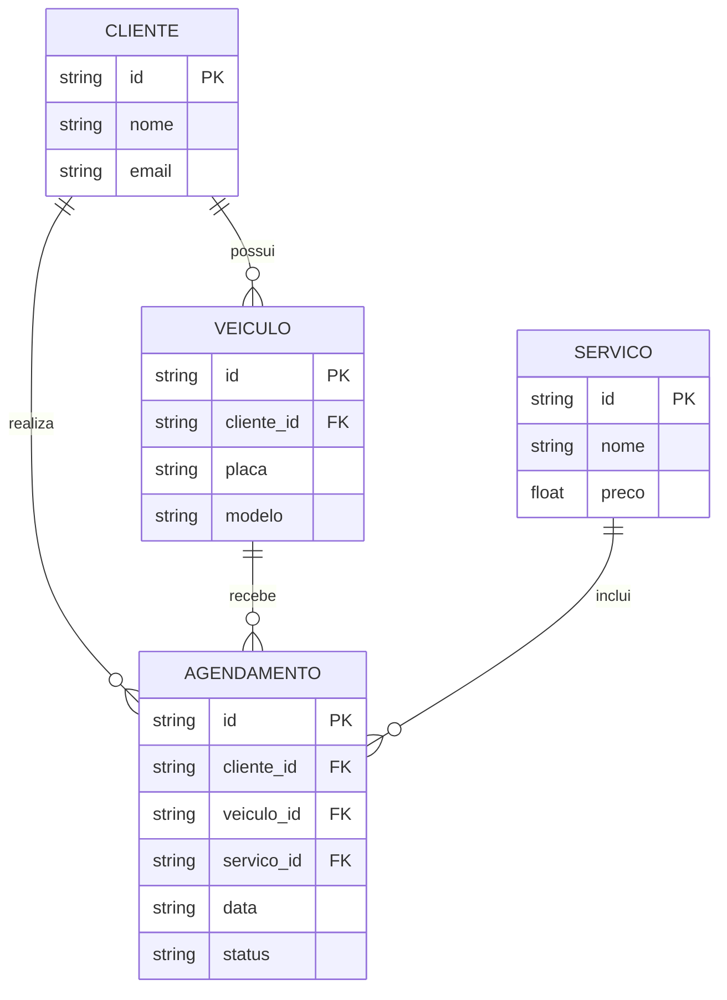

# Especificação Técnica (Architecture) - Ultra Legacy

Este documento apresenta de forma simples a estrutura técnica do sistema **Ultra Legacy**, incluindo o modelo de dados, API e armazenamento.

## 1. Modelo de Dados

O sistema possui clientes, veículos, serviços e agendamentos.

## 2. Dicionário de Dados

### Cliente

* `id`: identificador do cliente.
* `nome`: nome do cliente.
* `email`: e-mail.

### Veículo

* `id`: identificador do veículo.
* `cliente_id`: identifica o dono do veículo.
* `placa`: placa do veículo.
* `modelo`: modelo do veículo.

### Serviço

* `id`: identificador do serviço.
* `nome`: nome do serviço.
* `preco`: valor do serviço.

### Agendamento

* `id`: identificador do agendamento.
* `cliente_id`: cliente responsável.
* `vei
