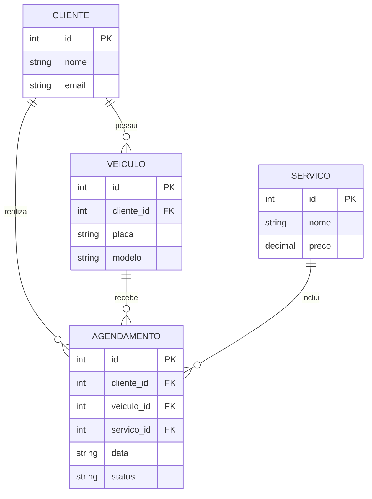

# 🛠️ Especificação Técnica — Ultra Legacy

## 1. Modelo de Dados



## 2. Tecnologias

* Bootstrap **5.3.3**
* Bootstrap Icons **1.11.3**
* Node.js / NPM
* JSON Server
* FIPE API **v1**
* LocalStorage

## 3. JSON Server

Principais rotas:

```text
GET/POST /clientes
GET/POST /veiculos
GET /servicos
GET/POST /agendamentos
```

Estrutura do `db.json`:

```json
{
  "clientes": [],
  "veiculos": [],
  "servicos": [],
  "agendamentos": []
}
```

## 4. FIPE API

A FIPE API será utilizada para complementar os dados dos veículos.

Fluxo:

```text
Tipo → Marca → Modelo → Ano → Dados do veículo
```

Base:

```text
https://parallelum.com.br/fipe/api/v1
```

Principais endpoints:

```text
GET /carros/marcas
GET /carros/marcas/{marcaId}/modelos
GET /carros/marcas/{marcaId}/modelos/{modeloId}/anos
GET /carros/marcas/{marcaId}/modelos/{modeloId}/anos/{anoId}
```

A placa será armazenada no sistema, mas não será utilizada para consulta direta na FIPE.

## 5. LocalStorage

Será utilizado para dados temporários, como:

* Última consulta;
* Preferências;
* Rascunhos de formulários.

O JSON Server será o armazenamento principal durante o desenvolvimento.
