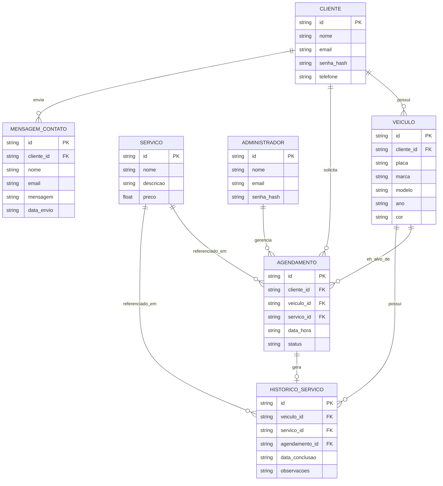

# Especificação Técnica (Architecture)

## 1. Visão Geral

Este documento descreve **como** o sistema da Ultra Legacy será estruturado do ponto de vista de dados, cobrindo as entidades necessárias para suportar o cadastro de clientes, veículos, serviços e agendamentos, além da integração com uma API externa de consulta de placas veiculares.

## 2. Modelo de Dados (Diagrama Mermaid)

## 3. Entidades e Relações (resumo)

- **CLIENTE**: usuário final que possui uma ou mais entradas em VEICULO e pode solicitar AGENDAMENTOs.
- **VEICULO**: pertence a um CLIENTE; os campos `marca`, `modelo`, `ano` e `cor` são preenchidos automaticamente a partir da consulta da `placa` na API externa, mas ficam salvos no banco para não depender de nova chamada a cada visualização.
- **SERVICO**: catálogo de serviços oferecidos pela estética (lavagem, polimento, vitrificação, etc.), com preço.
- **AGENDAMENTO**: liga um CLIENTE + VEICULO + SERVICO em uma data/hora, com um `status` (ex: pendente, confirmado, concluído, cancelado).
- **HISTORICO_SERVICO**: registro definitivo de um serviço já realizado em um veículo, geralmente criado a partir de um AGENDAMENTO concluído.
- **ADMINISTRADOR**: usuário interno que gerencia agendamentos, clientes e veículos.
- **MENSAGEM_CONTATO**: mensagens enviadas pelo formulário de contato do site institucional.

## 4. Integração com API de Placas Veiculares

- Ao cadastrar um veículo, o usuário informa apenas a **placa**.
- O sistema faz uma requisição a uma API pública/paga de consulta veicular (ex: serviços que consultam a base do Detran/Denatran a partir da placa) para obter `marca`, `modelo`, `ano` e `cor`.
- O retorno da API é usado para **preencher automaticamente** os campos de VEICULO antes de salvar no banco.
- Deve-se tratar o caso de a API não encontrar a placa (placa inválida, veículo não localizado) ou de a API estar indisponível — nesses casos, o Cliente/Administrador poderá preencher os dados manualmente.

## 5. Persistência de Dados (Fake API)

Enquanto não há um backend real, as entidades **CLIENTE**, **VEICULO**, **SERVICO** e **AGENDAMENTO** serão persistidas usando o **JSON Server** como API fake, rodando localmente a partir de um arquivo `db.json` com uma coleção para cada entidade (ex.: `/clientes`, `/veiculos`, `/servicos`, `/agendamentos`).

- Cadastro de cliente e de veículo → `POST` para o JSON Server (grava o formulário).
- Listagem de veículos, serviços e agendamentos → `GET` no JSON Server (exibe os dados na página).
- Consulta de placa → `GET` para a **API pública real** de placas veiculares (dado externo, não fica no JSON Server).

## 6. Uso de Web Storage (localStorage)

Para melhorar a experiência sem depender do backend, alguns dados de baixo risco ficam salvos no `localStorage` do navegador, por exemplo:

- Última placa pesquisada pelo usuário (para preencher automaticamente o campo na próxima visita).
- Preferências de exibição (ex.: tema claro/escuro, se implementado).
- Rascunho do formulário de agendamento, evitando perda de dados caso a página seja recarregada antes do envio.
