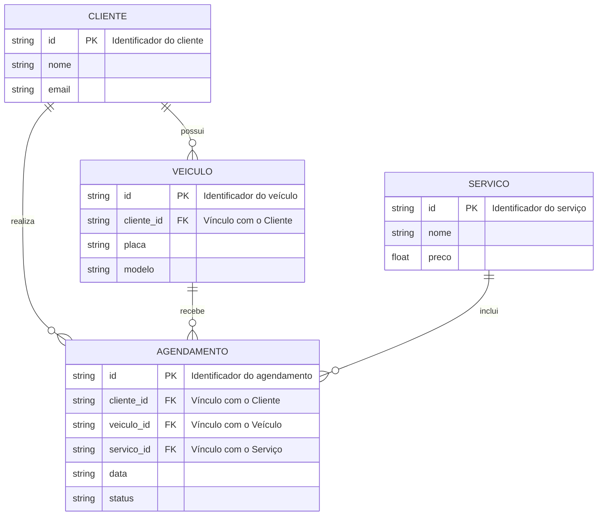

# 🛠️ Especificação Técnica (Tech Spec) - Ultra Legacy

Este documento detalha a arquitetura técnica, o modelo de dados e os contratos de API necessários para o funcionamento do sistema de estética automotiva **Ultra Legacy**.

## 1. Modelo de Dados (Diagrama ER)

Abaixo está o Diagrama Entidade-Relacionamento (DER) que representa a estrutura do banco de dados simulado (`db.json`) e como as informações se conectam.



## 2. Dicionário de Dados

Breve explicação das principais entidades do sistema:

* **Clientes:** Responsável por armazenar os dados dos clientes cadastrados no sistema.

  * `id`: Identificador único do cliente.
  * `nome`: Nome do cliente.
  * `email`: E-mail do cliente.

* **Veículos:** Armazena os veículos cadastrados e seu vínculo com o respectivo cliente.

  * `id`: Identificador único do veículo.
  * `cliente_id`: Chave estrangeira que identifica o proprietário do veículo.
  * `placa`: Placa do veículo.
  * `modelo`: Modelo do veículo.

* **Serviços:** Armazena os serviços oferecidos pela estética automotiva.

  * `id`: Identificador único do serviço.
  * `nome`: Nome do serviço.
  * `preco`: Valor do serviço.

* **Agendamentos:** Registra os serviços agendados para cada veículo e cliente.

  * `id`: Identificador único do agendamento.
  * `cliente_id`: Chave estrangeira que identifica o cliente responsável pelo agendamento.
  * `veiculo_id`: Chave estrangeira que identifica o veículo relacionado ao agendamento.
  * `servico_id`: Chave estrangeira que identifica o serviço escolhido.
  * `data`: Data do agendamento.
  * `status`: Situação atual do agendamento.

## 3. Rotas da API (JSON Server)

A aplicação utiliza o **JSON Server** como uma API local simulada para armazenar, cadastrar e consultar os dados do sistema.

Principais endpoints:

* `GET /clientes` - Retorna a lista de clientes.
* `POST /clientes` - Cadastra um novo cliente.
* `GET /veiculos` - Retorna a lista de veículos.
* `POST /veiculos` - Cadastra um novo veículo.
* `GET /servicos` - Retorna a lista de serviços.
* `GET /agendamentos` - Retorna a lista de agendamentos.
* `POST /agendamentos` - Cadastra um novo agendamento.

## 4. Estrutura do Banco de Dados (db.json)

Esta é a representação da estrutura do banco de dados simulado. O arquivo `db.json` será utilizado pelo JSON Server para inicializar e armazenar os dados da aplicação.

```json
{
    "clientes": [],
    "veiculos": [],
    "servicos": [],
    "agendamentos": []
}
```

## 5. Integração com a FIPE API

O sistema utiliza a **FIPE API** como API pública para consulta de informações e valores de referência de veículos.

A API permite consultar veículos de acordo com uma sequência de informações, como tipo de veículo, marca, modelo e ano.

O fluxo de consulta utilizado pela aplicação será:

1. Selecionar o tipo de veículo.
2. Consultar e selecionar a marca.
3. Consultar e selecionar o modelo.
4. Consultar os anos disponíveis para o modelo.
5. Consultar os dados finais do veículo e seu valor de referência.

### Principais endpoints

* `GET /carros/marcas` - Lista as marcas de carros.
* `GET /carros/marcas/{marcaId}/modelos` - Lista os modelos de uma marca.
* `GET /carros/marcas/{marcaId}/modelos/{modeloId}/anos` - Lista os anos disponíveis para um modelo.
* `GET /carros/marcas/{marcaId}/modelos/{modeloId}/anos/{anoId}` - Retorna os dados e o valor de referência do veículo.

### URL base

```text
https://parallelum.com.br/fipe/api/v1
```

As requisições para a FIPE API serão realizadas de forma assíncrona utilizando JavaScript.

A aplicação deverá tratar possíveis erros durante a comunicação com a API, como falha na requisição, ausência de dados ou indisponibilidade do serviço.

A consulta da FIPE API será utilizada como recurso complementar ao cadastro de veículos do sistema **Ultra Legacy**.

## 6. LocalStorage

O `localStorage` poderá ser utilizado como mecanismo auxiliar para armazenar informações simples no navegador, como:

* última consulta de veículo realizada;
* preferências do usuário;
* dados temporários de formulários.

O `localStorage` será utilizado como apoio à aplicação, enquanto o **JSON Server** será responsável pelo armazenamento principal dos dados.
