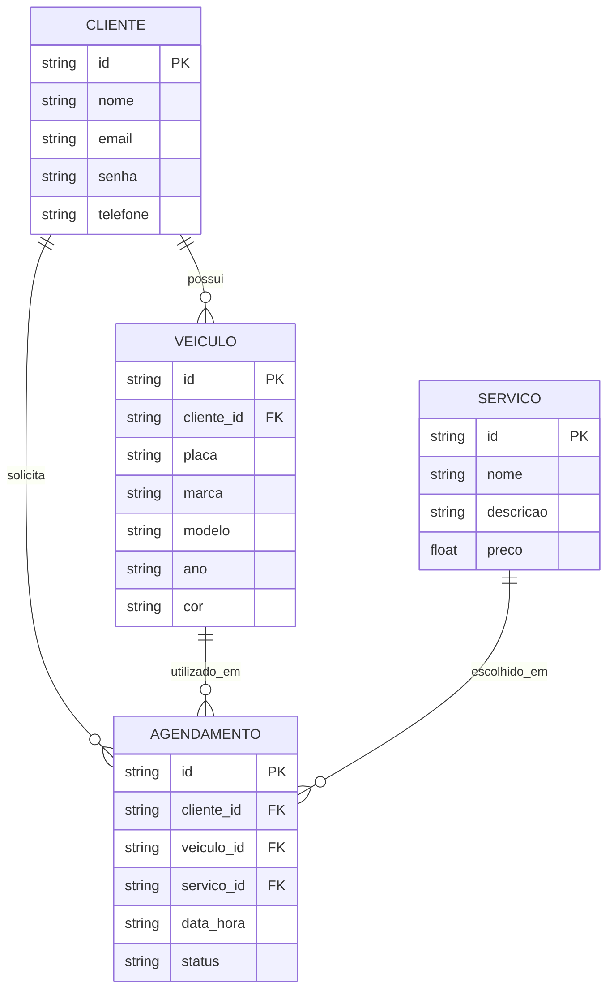

# Especificação Técnica (Architecture) - Ultra Legacy

Este documento apresenta de forma simples a estrutura técnica do sistema **Ultra Legacy**, incluindo os principais dados, relacionamentos e uso do JSON Server.

## 1. Modelo de Dados

O sistema possui clientes, veículos, serviços e agendamentos.



## 2. Dicionário de Dados

* **Cliente:** armazena os dados do cliente que utiliza o sistema.

  * `id`: identificador do cliente.
  * `nome`: nome do cliente.
  * `email`: e-mail utilizado no sistema.
  * `senha`: senha de acesso.
  * `telefone`: telefone do cliente.

* **Veículo:** armazena os veículos cadastrados pelo cliente.

  * `id`: identificador do veículo.
  * `cliente_id`: identifica o cliente dono do veículo.
  * `placa`: placa do veículo.
  * `marca`: marca do veículo.
  * `modelo`: modelo do veículo.
  * `ano`: ano do veículo.
  * `cor`: cor do veículo.

* **Serviço:** representa os serviços oferecidos pela Ultra Legacy.

  * `id`: identificador do serviço.
  * `nome`: nome do serviço.
  * `descricao`: descrição do serviço.
  * `preco`: preço do serviço.

* **Agendamento:** registra o serviço escolhido pelo cliente.

  * `id`: identificador do agendamento.
  * `cliente_id`: cliente responsável pelo agendamento.
  * `veiculo_id`: veículo que receberá o serviço.
  * `servico_id`: serviço escolhido.
  * `data_hora`: data e horário agendados.
  * `status`: situação do agendamento.

## 3. Rotas da API

O projeto utiliza o **JSON Server** como uma API simulada para armazenar e consultar os dados.

Principais rotas:

* `GET /clientes` - Lista os clientes.
* `POST /clientes` - Cadastra um cliente.
* `GET /veiculos` - Lista os veículos.
* `POST /veiculos` - Cadastra um veículo.
* `GET /servicos` - Lista os serviços.
* `GET /agendamentos` - Lista os agendamentos.
* `POST /agendamentos` - Cadastra um novo agendamento.

## 4. Estrutura do Banco de Dados

Os dados serão armazenados no arquivo `db.json`.

Exemplo:

```json
{
    "clientes": [],
    "veiculos": [],
    "servicos": [],
    "agendamentos": []
}
```

## 5. Consulta de Placa

Ao cadastrar um veículo, o usuário informa a placa.

O sistema poderá consultar uma API externa para buscar informações como:

* marca;
* modelo;
* ano;
* cor.

Essas informações podem ser utilizadas para preencher o cadastro do veículo automaticamente.

## 6. LocalStorage

O `localStorage` poderá ser utilizado para guardar informações simples no navegador, como:

* última placa pesquisada;
* preferências de exibição;
* dados temporários de um formulário.

O objetivo é melhorar a experiência do usuário sem substituir o armazenamento principal feito pelo JSON Server.
