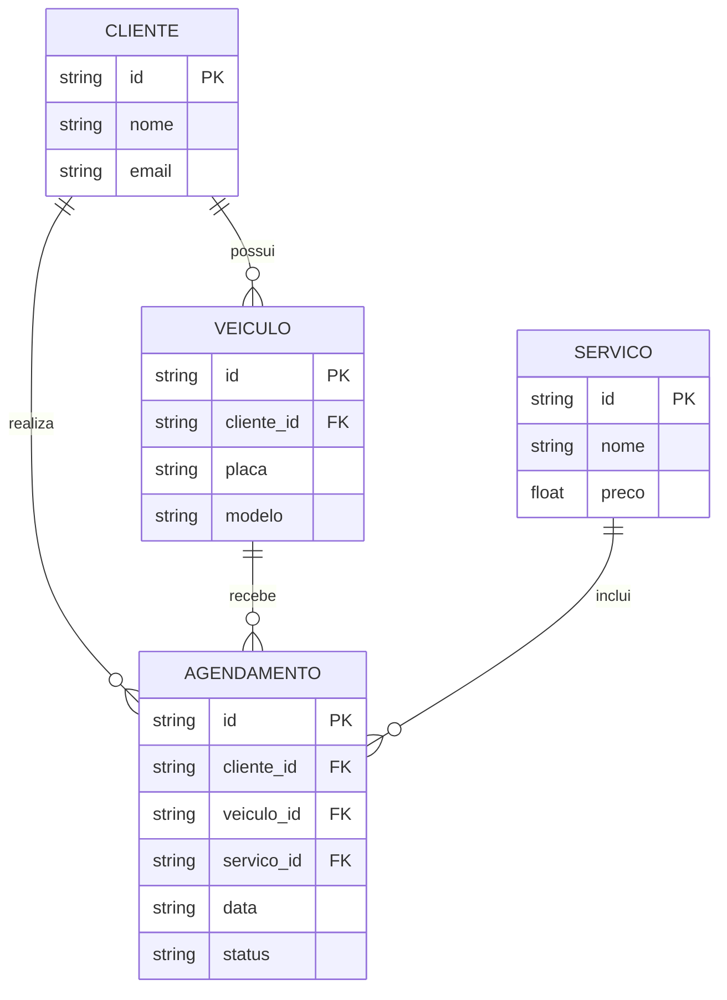

# Especificação Técnica (Architecture) - Ultra Legacy

Este documento apresenta de forma simples a estrutura técnica do sistema **Ultra Legacy**, incluindo o modelo de dados, API e armazenamento.

## 1. Modelo de Dados

O sistema possui clientes, veículos, serviços e agendamentos.



## 2. Dicionário de Dados

### Cliente

* `id`: identificador do cliente.
* `nome`: nome do cliente.
* `email`: e-mail.

### Veículo

* `id`: identificador do veículo.
* `cliente_id`: identifica o dono do veículo.
* `placa`: placa do veículo.
* `modelo`: modelo do veículo.

### Serviço

* `id`: identificador do serviço.
* `nome`: nome do serviço.
* `preco`: valor do serviço.

### Agendamento

* `id`: identificador do agendamento.
* `cliente_id`: cliente responsável.
* `veiculo_id`: veículo do agendamento.
* `servico_id`: serviço escolhido.
* `data`: data do agendamento.
* `status`: situação do agendamento.

## 3. Rotas da API

O projeto utiliza o **JSON Server** como uma API simulada para armazenar e consultar os dados.

* `GET /clientes` - Lista os clientes.
* `POST /clientes` - Cadastra um cliente.
* `GET /veiculos` - Lista os veículos.
* `POST /veiculos` - Cadastra um veículo.
* `GET /servicos` - Lista os serviços.
* `GET /agendamentos` - Lista os agendamentos.
* `POST /agendamentos` - Cadastra um agendamento.

## 4. Estrutura do Banco de Dados

Os dados serão armazenados no arquivo `db.json`.

```json
{
    "clientes": [],
    "veiculos": [],
    "servicos": [],
    "agendamentos": []
}
```

## 5. Consulta de Placa

Ao cadastrar um veículo, o usuário informa a placa.

O sistema poderá consultar uma API externa para obter informações do veículo, como marca, modelo e ano.

## 6. LocalStorage

O `localStorage` poderá ser utilizado para armazenar informações simples no navegador, como:

* última placa pesquisada;
* preferências do usuário;
* dados temporários de formulário.

O `localStorage` será utilizado apenas como apoio, enquanto o **JSON Server** será responsável pelo armazenamento principal dos dados.
