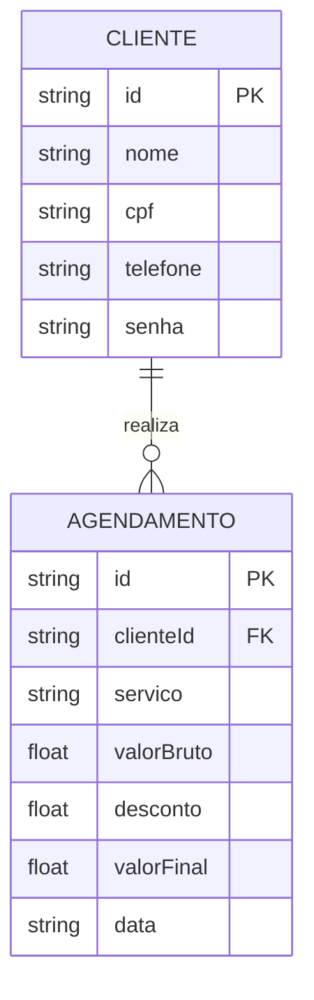

# Architecture — Ultra Legacy

## 1. Visão Geral

O sistema da **Ultra Legacy** utiliza uma arquitetura simples baseada em **HTML, CSS, JavaScript e JSON Server**.

O JSON Server funciona como uma API local para armazenar clientes e agendamentos no arquivo `db.json`.

---

## 2. Modelo de Dados

O sistema possui duas entidades principais:

* **Cliente:** armazena os dados de cadastro e acesso.
* **Agendamento:** armazena os serviços agendados pelos clientes.

### Diagrama ER


```mermaid
erDiagram
    CLIENTE ||--o{ AGENDAMENTO : realiza

    CLIENTE {
        string id PK
        string nome
        string cpf
        string telefone
        string senha
    }

    AGENDAMENTO {
        string id PK
        string clienteId FK
        string servico
        float valorBruto
        float desconto
        float valorFinal
        string data
    }
```

---

## 3. Dicionário de Dados

### Cliente

| Campo      | Descrição                                       |
| ---------- | ----------------------------------------------- |
| `id`       | Identificador único do cliente.                 |
| `nome`     | Nome completo do cliente.                       |
| `cpf`      | CPF utilizado para acesso ao sistema.           |
| `telefone` | Telefone para contato e confirmação do serviço. |
| `senha`    | Senha utilizada no acesso.                      |

### Agendamento

| Campo        | Descrição                                                   |
| ------------ | ----------------------------------------------------------- |
| `id`         | Identificador único do agendamento.                         |
| `clienteId`  | Identifica o cliente responsável pelo agendamento.          |
| `servico`    | Serviço automotivo escolhido.                               |
| `valorBruto` | Valor original do serviço.                                  |
| `desconto`   | Valor do desconto de fidelidade, calculado automaticamente. |
| `valorFinal` | Valor final após a aplicação do desconto.                   |
| `data`       | Data do agendamento no formato `YYYY-MM-DD`.                |

### Regra de negócio

Todo agendamento realizado pelo cliente possui um **desconto automático de 10%**.

O JavaScript calcula o desconto e o valor final:

```text
desconto = valorBruto × 10%
valorFinal = valorBruto - desconto
```

---

## 4. API — JSON Server

A aplicação utiliza o **JSON Server** para simular uma API REST local.

### Clientes

```http
GET /clientes
```

Retorna todos os clientes.

```http
POST /clientes
```

Cadastra um novo cliente.

### Agendamentos

```http
GET /agendamentos?clienteId=1
```

Retorna os agendamentos de um cliente específico.

```http
POST /agendamentos
```

Cadastra um novo agendamento.

---

## 5. Banco de Dados

Os dados são armazenados no arquivo `db.json`.

Exemplo:

```json
{
  "clientes": [
    {
      "id": "1",
      "nome": "João da Silva",
      "cpf": "12345678900",
      "telefone": "41999998888",
      "senha": "senha_super_segura"
    }
  ],
  "agendamentos": [
    {
      "id": "1",
      "clienteId": "1",
      "servico": "Polimento Técnico",
      "valorBruto": 350.00,
      "desconto": 35.00,
      "valorFinal": 315.00,
      "data": "2026-03-16"
    },
    {
      "id": "2",
      "clienteId": "1",
      "servico": "Higienização Interna",
      "valorBruto": 200.00,
      "desconto": 20.00,
      "valorFinal": 180.00,
      "data": "2026-03-17"
    }
  ]
}
```

---

## 6. Fluxo da Aplicação

O funcionamento básico do sistema segue o seguinte fluxo:

1. O cliente realiza o cadastro.
2. Os dados são enviados para `/clientes`.
3. O cliente acessa o sistema utilizando seu CPF e senha.
4. O cliente escolhe um serviço e realiza um agendamento.
5. O JavaScript calcula automaticamente o desconto de 10%.
6. O agendamento é enviado para `/agendamentos`.
7. O sistema pode consultar os agendamentos utilizando o `clienteId`.

---

## 7. Tecnologias

* **HTML** — estrutura das páginas.
* **CSS** — estilização e responsividade.
* **JavaScript** — regras de negócio e comunicação com a API.
* **JSON Server** — API REST local.
* **db.json** — armazenamento dos dados.
